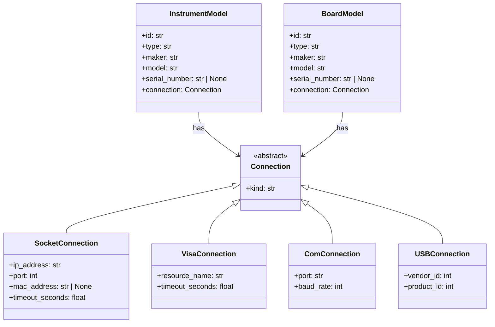
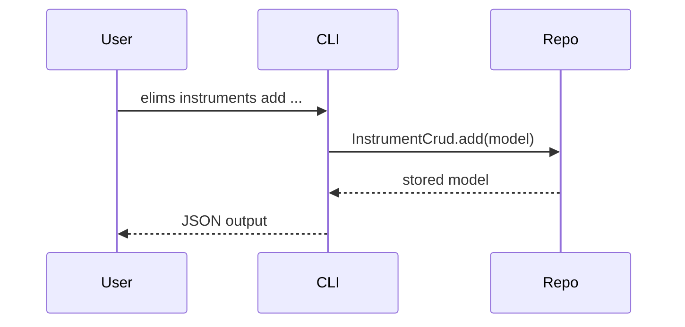

# Architecture

This document shows the high-level architecture of the `elims_instruments` package.

## Class Diagram (Mermaid UML)

## Sequence (CLI -> CRUD)

## Draw.io Diagram

An exported, editable diagram is available at `docs/assets/architecture.svg`.
