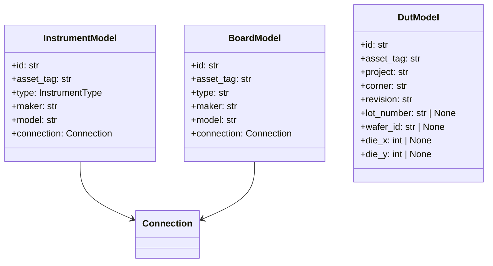
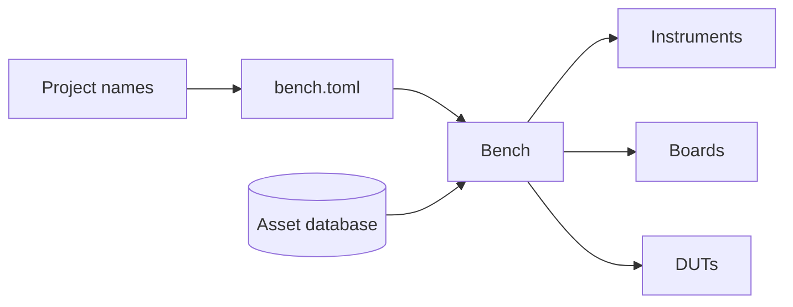

# Architecture

The database stores physical assets. Instruments and boards can be reused by
many projects; each DUT stores its owning project.

`bench.toml` maps project-owned `InstrumentName`, `BoardName`, and `DutName`
roles to asset tags. `Bench` validates those names, resolves the assets, and
exposes read-only collections.

The CLI groups use the same validated models and CRUD repositories as the
Python API.

Schema changes are versioned with Alembic and applied with
`elims database upgrade`.
