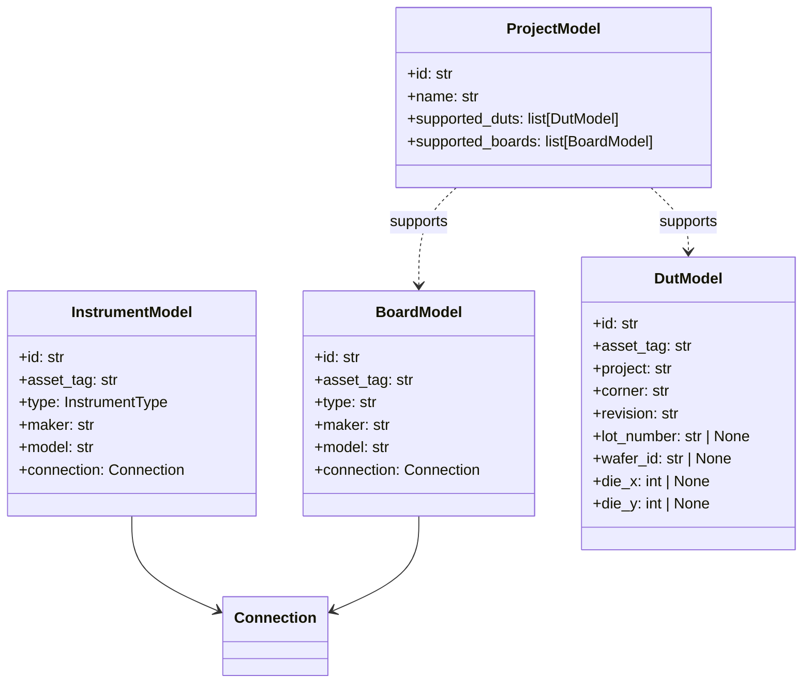
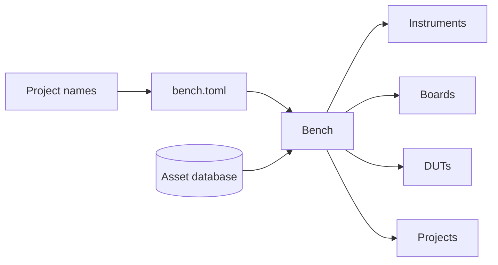

# Architecture

The database stores physical assets. Instruments and boards can be reused by
many projects; each DUT stores its owning project.

`bench.toml` maps project-owned instrument, board, DUT, and project role names
to database identifiers. Asset roles use asset tags; project roles use unique
project names. `Bench` validates those names, resolves the records, and exposes
read-only collections.

The instrument, board, DUT, and project CLI groups use the same validated
models and CRUD repositories as the Python API.

Schema changes are versioned with Alembic and applied with
`elims database upgrade`.
