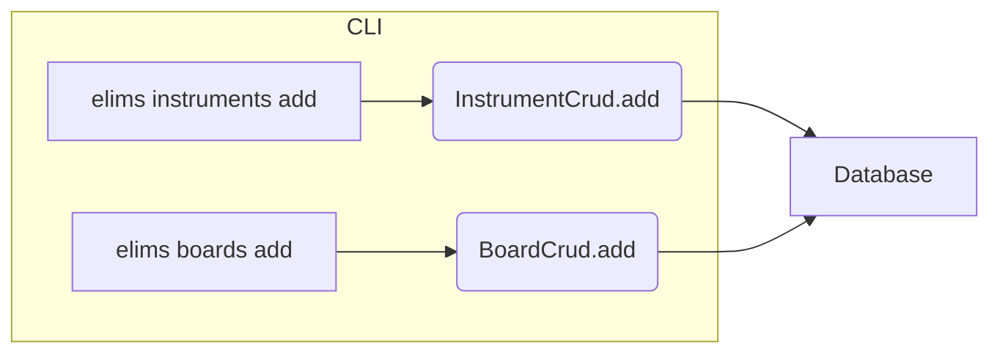

# CLI

The command-line interface is implemented under `elims_instruments.cli` and
exposes the `instruments` and `boards` command groups.

## Commands (Mermaid flow)



Examples:

```
uv run elims instruments add scope-1 --type oscilloscope --maker Keysight \
  --model DSOX1204G --connection socket --ip-address 192.168.1.10 --port 5025

uv run elims boards add board-1 --type controller --maker Acme --model CTRL-1 \
  --connection com --com-port COM3
```
