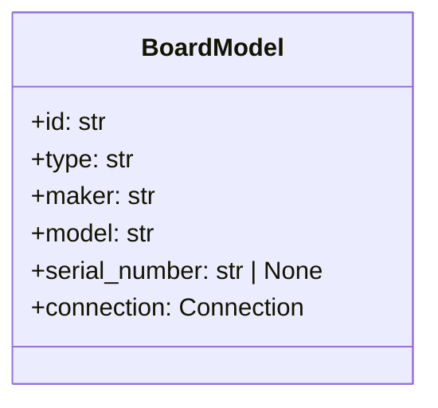

# Boards (database)

Models and repository for boards: `elims_instruments.database.board`.

## BoardModel

Fields:

- `id`: str (primary key)
- `type`: str
- `maker`: str
- `model`: str
- `serial_number`: Optional[str]
- `connection`: `Connection` (see Connections)

## BoardCrud

Provides `add`, `fetch`, `fetchall`, `update`, `remove`, and `upsert_many`.
