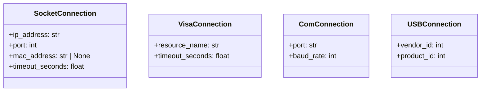

# Connections (database)

Shared connection models live in `elims_instruments.database.connections`.

## Models (Mermaid UML)

## Usage

- Use the `Connection` discriminated union to accept any supported connection.
- `ConnectionType` is a SQLAlchemy `TypeDecorator` that stores validated
  connection models as JSON in the database.
