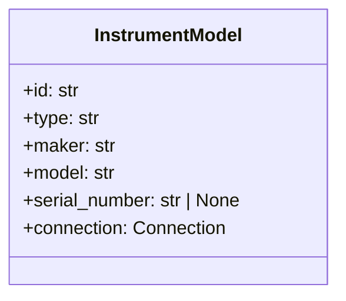

# Instruments (database)

Models and repository for instruments: `elims_instruments.database.instrument`.

## InstrumentModel

Fields:

- `id`: str (primary key)
- `type`: str
- `maker`: str
- `model`: str
- `serial_number`: Optional[str]
- `connection`: `Connection` (see Connections)

## InstrumentCrud

Provides `add`, `fetch`, `fetchall`, `update`, `remove`, and `upsert_many`.
